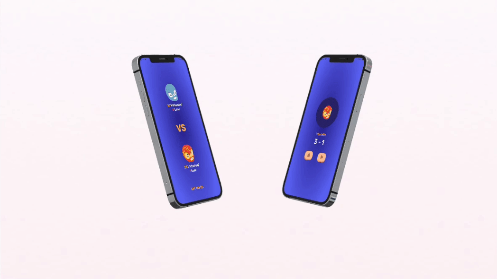

# Epic RPC

 

### В разработке участвовали:

 

### О приложении:

- **Простая и популярная игра для двух игроков, которая часто используется для быстрого принятия решений или просто для развлечения.** Цель игры — выиграть как можно больше раундов, демонстрируя правильные жесты против жестов соперника. Игра длится до трёх побед одного из игроков.

- **Функционал:**
  * статистика пользователей 
  * выбор игры с реальным пользователем или системой
  * настройка музыки и времени раунда
  * смена аватара игрока
  * правила игры 
  * возможность поставить игру на паузу

- **Swift / UIKit / UserDefaults**
  
- **Архитектура**: MVC
  
- **Фреймворки**: 
  * SnapKit 
  * RxSwift
  * RxGesture
